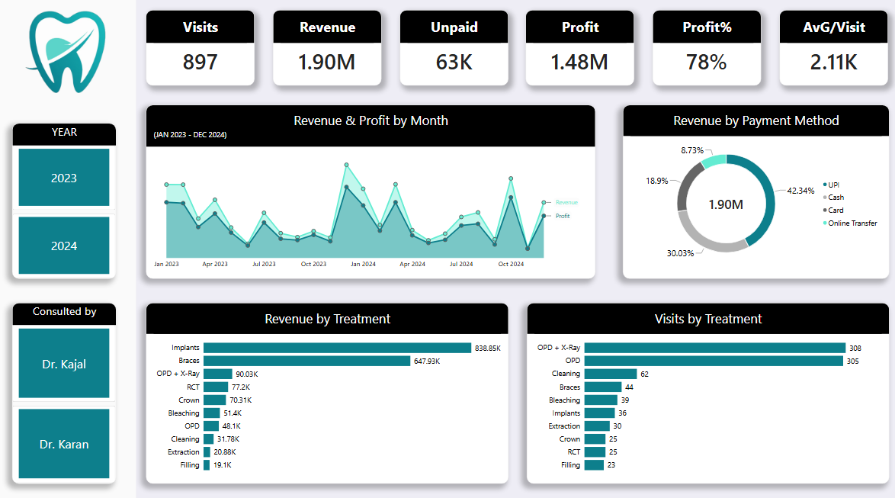
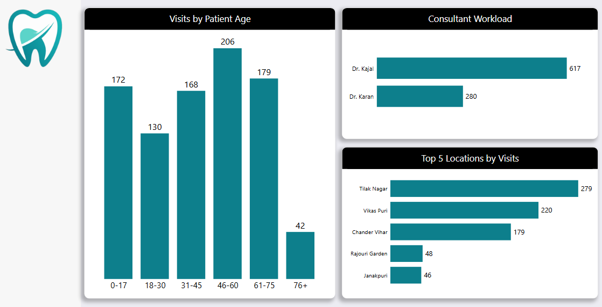

# mldc-dental-dashboard

## Project Overview
This project delivers a two-page interactive Power BI analytical solution built to evaluate patient billing, treatment profitability, and clinic operations for ML Dental Clinic (MLDC). Starting from a raw patient-visit export, the data was cleaned, modeled, and translated with DAX into a clear picture of where revenue, profit, and patient traffic actually come from, supporting decisions on staffing, pricing, and outreach.

---

## Key Insights & Metrics
- **Financial Performance:** Generated **₹18,95,580** in Total Revenue with a **78% Profit Margin** (**₹14,75,630** Net Profit, after lab costs) across **897 patient visits** (Jan 2023 - Dec 2024).
- **Treatment Profitability:** *Implants* and *Braces* drive **~78% of total revenue** from just **~9% of visits**, while routine care (*OPD*, *X-Ray*, *Cleaning*) fills most of the calendar but contributes a small share of revenue.
- **Clinician Workload:** Two consulting dentists split patient volume unevenly: **Dr. Kajal (69%, 617 visits)** vs. **Dr. Karan (31%, 280 visits)**.
- **Patient Geography:** Three neighborhoods, *Tilak Nagar*, *Vikas Puri*, and *Chander Vihar*, account for **~76% of all patient visits**.
- **Payments & Collections:** *UPI* is the leading payment method (**42% of revenue**), and **₹63K remains unpaid** across 24 visits, flagged for billing follow-up.

---

## Tools & Techniques Used
- **Power Query & Data Modeling:** Removed a fully redundant duplicate column, corrected date-format parsing, and validated the data (zero missing values, zero duplicate visit IDs across 897 rows).
- **DAX (Data Analysis Expressions):** Custom measures for core metrics (*Total Revenue, Total Profit, Profit Margin %, Avg Revenue/Visit, Outstanding Due*) plus a calculated column to bucket patients into age bands.
- **Dashboarding & UX Design:** Two-page layout (Overview + Patients & Operations) with a persistent KPI row, Year and Clinician slicers, and a Top-N filter to keep the neighborhood chart readable.

---

## Dashboard Preview

### 1. Overview

### 2. Patients & Operations

---

## Data Source
Built from Kaggle's *"Dental Clinic Patient Data (2023-2024)"*, a dataset explicitly labeled fictional and intended for educational use. All figures above are a worked analytics example, not real patient or financial records.

---

## Project Files
- **[Download / View Power BI Dashboard](Mldc%20Dental%20Dashboard.pbix)**
